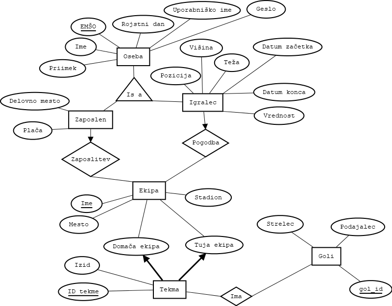

# IV. vaška nogometna liga

# Opis
Za projekt pri predmetu OPB smo ustvarili spletno stran, ki omogoča vodenje nogometne lige. Prek spletne strani lahko dodajamo/urejamo/odstranjujemo sodelujoče ekipe, osebe, odigrane tekme in dosežene zadetke, vendar je za to potrebna registracija, oziroma prijava. Brez prijave lahko vseeno dostopamo do spletne strani in podatkov, vendar brez možnosti dodajanja/urejanja/odstranjevanja.

# Navodila za uporabo
Za uporabo aplikacije zaženite datoteko **nogometna_liga.py**.

---
  

